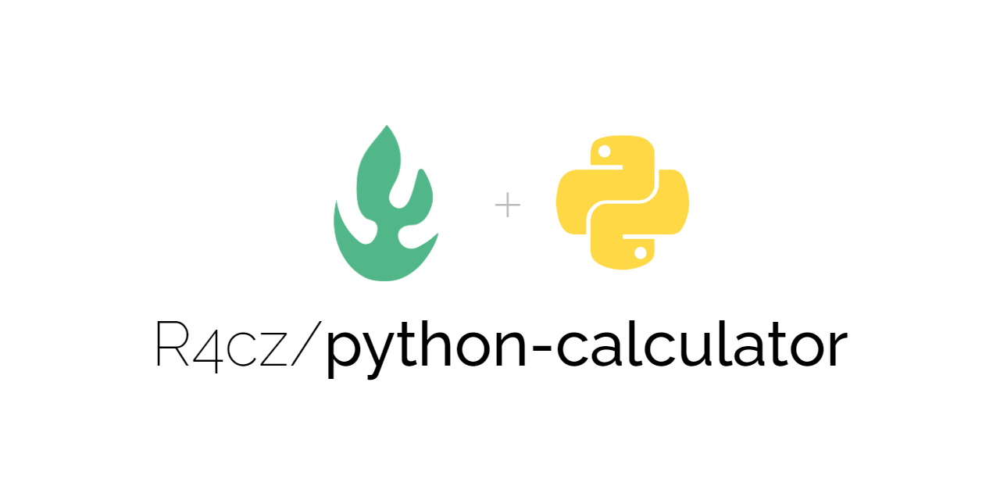

<h1 align="center" id="title">Python Calculator</h1>

<p align="center"></p>

<p id="description">Simple calculator with graphical interface.</p>

## Table of Contents

- [Demo](#demo)
- [Features](#features)
- [Installation Step](#installation-steps)
- [The process](#the-process)
  - [Built with](#built-with)
  - [Structure](#structure)
- [Useful resources](#useful-resources)
- [License](#license)
- [Author](#author)

## Demo


  
## Features

Here're some of the project's best features:

*   Calculate basic functions such as addition, subtraction, multiplication, and division.
*   Parentheses: Determine the order of actions in an expression.

## Installation Steps:

1. Clone the repository.
2. Open the project with Visual Studio Code.
3. Run the app and enjoy it.

## The process 
### Built with

Technologies used in the project:

*   Python 3.9
*   Parser
*   Visual Studio Code 1.70.2

### Structure

``` Python
    def calculate(self):
        display_state = self.display.get()
        try:
            math_expression = parser.expr( display_state).compile()
            result = eval( math_expression)
            self.clear_display()
            self.display.insert( 0, result)
        except Exception:
            self.clear_display()
            self.display.insert( 0, 'SyntaxError')
```

## Useful resources

* [Python](https://www.python.org/) - Used to create the algorithms.
* [Visual Studio Code](https://code.visualstudio.com/) - Source code editor developed by Microsoft.

## License:

> This project is licensed under the MIT License

## Author

Made with 💚 by [R4cz](https://www.linkedin.com/in/r4cz/)
